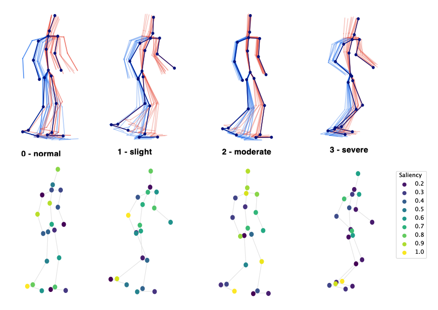

# Vision-based Estimation of MDS-UPDRS Gait Scores for Assessing Parkinson's Disease Motor Severity

This repository is the official implementation of: 

[**Vision-based Estimation of MDS-UPDRS Gait Scores for Assessing Parkinson's Disease Motor Severity**](https://arxiv.org/abs/2007.08920)\
Mandy Lu, Kathleen Poston, Adolf Pfefferbaum, Edith V. Sullivan, Li Fei-Fei, Kilian M. Pohl, Juan Carlos Niebles, Ehsan Adeli\
*MICCAI 2020*



*3D input poses of four subjects with increasing PD motor severity (top) and saliency of classifier (bottom).*

The oral presentation of this work at MICCAI can be viewed [here](https://www.youtube.com/watch?v=XZrY5vQuPHQ&ab_channel=EhsanAdeli).

## Requirements

To install requirements, run:

```setup
pip install -r requirements.txt
```

with Python 3 (3.7 used).

## Pose Extraction

The Stanford Medicine Gait Dataset is not publically available, but the [CASIA Gait Database](http://www.cbsr.ia.ac.cn/english/Gait%20Databases.asp) is available upon [request](http://www.cbsr.ia.ac.cn/english/Gait%20Databases.asp). Any similar video dataset with human movement can be used as input.  

To obtain the input poses for the classifier, clone and follow the instructions in the [VIBE](https://github.com/mkocabas/VIBE) repo. The script ```extract_joints <path_to_data> <output_path>``` takes a folder of videos, runs VIBE on them, and produces outputs joints in the correct format for the classifier. The output files we use are the ```vibe_output.pkl``` files generated by VIBE. An example joint file generated by VIBE from the CASIA dataset is in ```data/sample``` with an image from the source video. The initial paper detailed a longer data preprocessing sequence which has been condensed in VIBE, so the simpler version is provided. 

## Data Preprocessing

```data_preprocessing.ipynb``` provides step-by-step instructions for preprocessing joint data.

## Training

To train the model(s) in the paper, run this command:

```train
python train.py --model_dir <params_and_output_path> --seed <random_seed>
```

or use

```train
python train.py
```

for the default mode. The ```model_dir``` should contain a params.json file formatted as in ```jobs/default/params.json```.

## References

If you use this code in your research, please cite our [paper](https://arxiv.org/abs/2007.08920).

```
@inproceedings{lu2020vision,
  title={Vision-based Estimation of MDS-UPDRS Gait Scores for Assessing Parkinson’s Disease Motor Severity},
  author={Lu, Mandy and Poston, Kathleen and Pfefferbaum, Adolf and Sullivan, Edith V and Fei-Fei, Li and Pohl, Kilian M and Niebles, Juan Carlos and Adeli, Ehsan},
  booktitle={International Conference on Medical Image Computing and Computer-Assisted Intervention},
  pages={637--647},
  year={2020},
  organization={Springer}
}
```

These resources were used or cited within the code:

- **VIBE** [paper](https://arxiv.org/abs/1912.05656) [code](https://github.com/mkocabas/VIBE).
- **DD-Net** [paper](https://arxiv.org/pdf/1907.09658.pdf) [code](https://github.com/fandulu/DD-Net).

## Contact for Questions

Mandy Lu, mlu@cs.stanford.edu
